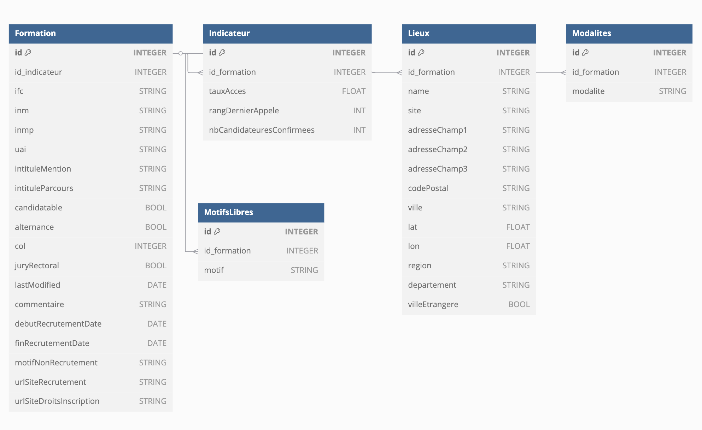

# Scraping du site monmaster

Petits scripts pour récupérer les données de monmaster 2025 et les afficher sur une carte html.
Utile pour regarder les formations disponibles sur une carte de France.


## Scraper les données :
```python
python scrapping.py
```

## Générer la carte :
```python
python carte.py
```

## Diagramme de la base de données :

